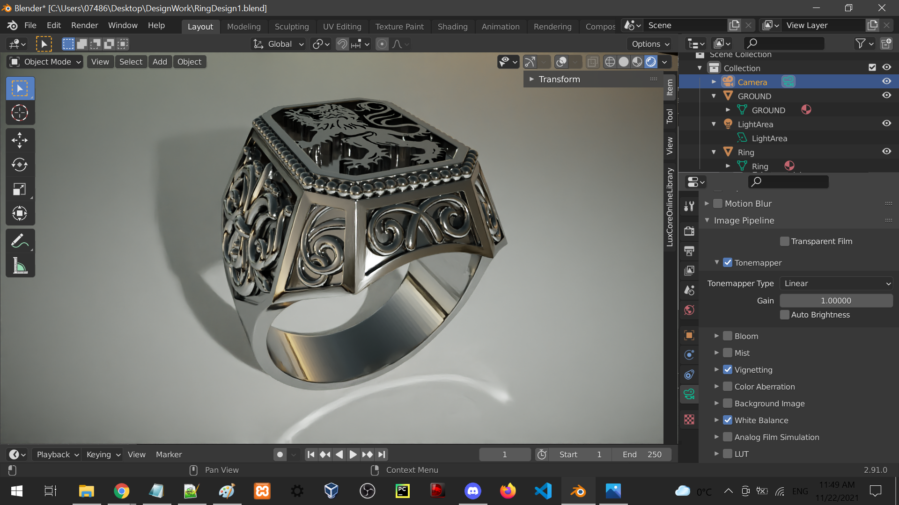
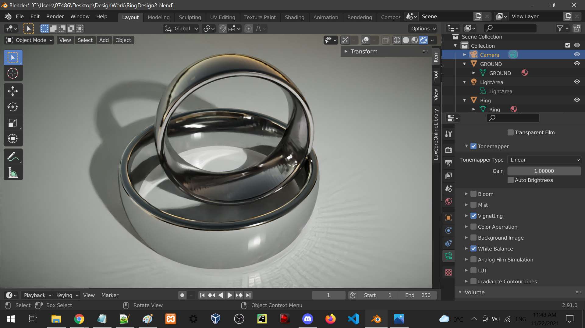
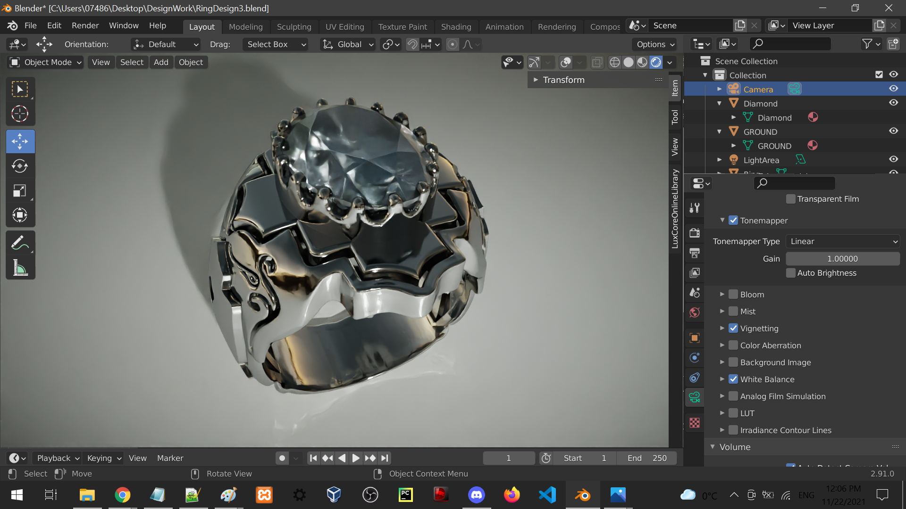
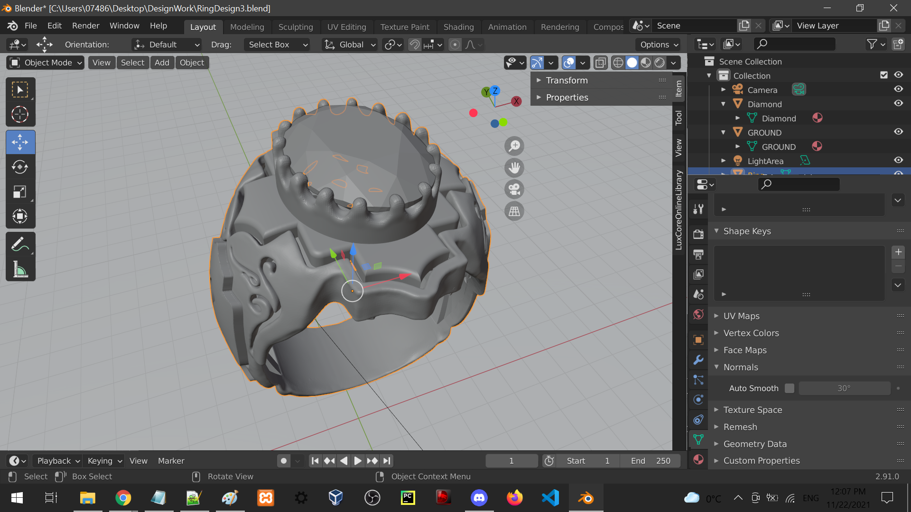
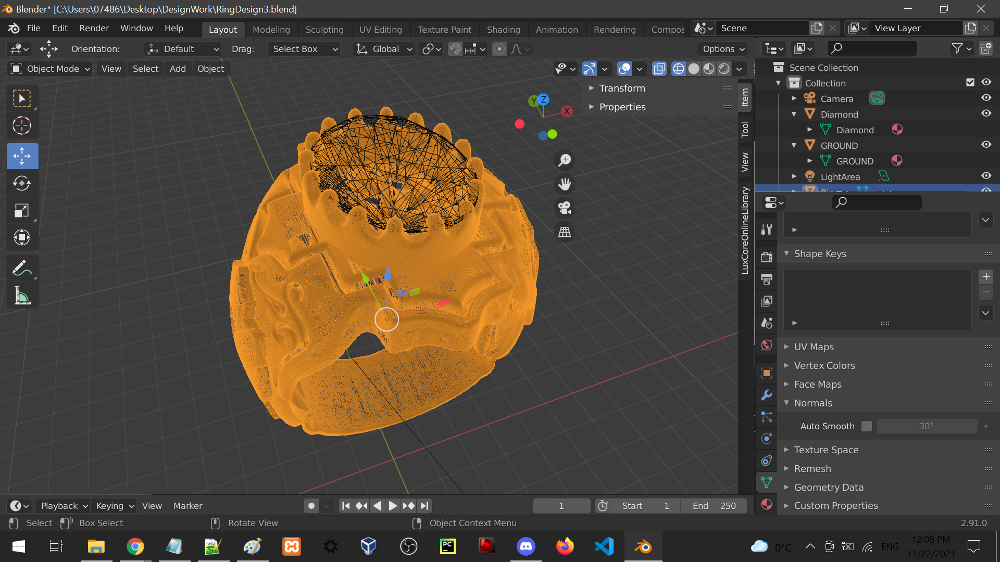

# Rendering-Work
Rendering 3D models using the LuxCoreRender. The project includes examples that use metal material nodes shaders, and metal with diamonds rendered with a glass material shader under different light settings.

<strong> Grahpics Software and Renderers Used:  </strong>
<ul>
 	<li> LuxCore Renderer-v2.5-win64 </li>
 	<li> Blender 2.91.0-windows64 </li>
</ul>

<strong> Platform Test:  </strong>
<ul>
 	<li> Windows </li>
</ul>

###  The Views of the 3D model with, and without the shader are shown below:

#  A couple of things to note:

<ul>
 <li>
Roughness under the metal materials shader needs to be low to allow more reflection, which is why it's set to 0.01.
 </li>
	
 <li>	
Under the world properties settings, increasing the light gain will better show the feedback of the light hitting the ground, and brighten the metal parts of the 3D object for more exposure. An example of this is shown under the "Light" folder in the "Github Pages" folder included in the repo.
 </li>

<li>
Ring 3 uses a different subset of values due to the glass material shader to render the diamond. The Light gain value is set to 2.0 instead of 1.0, and gamma is set to 1 instead of 0.9.
 </li>
</ul>
